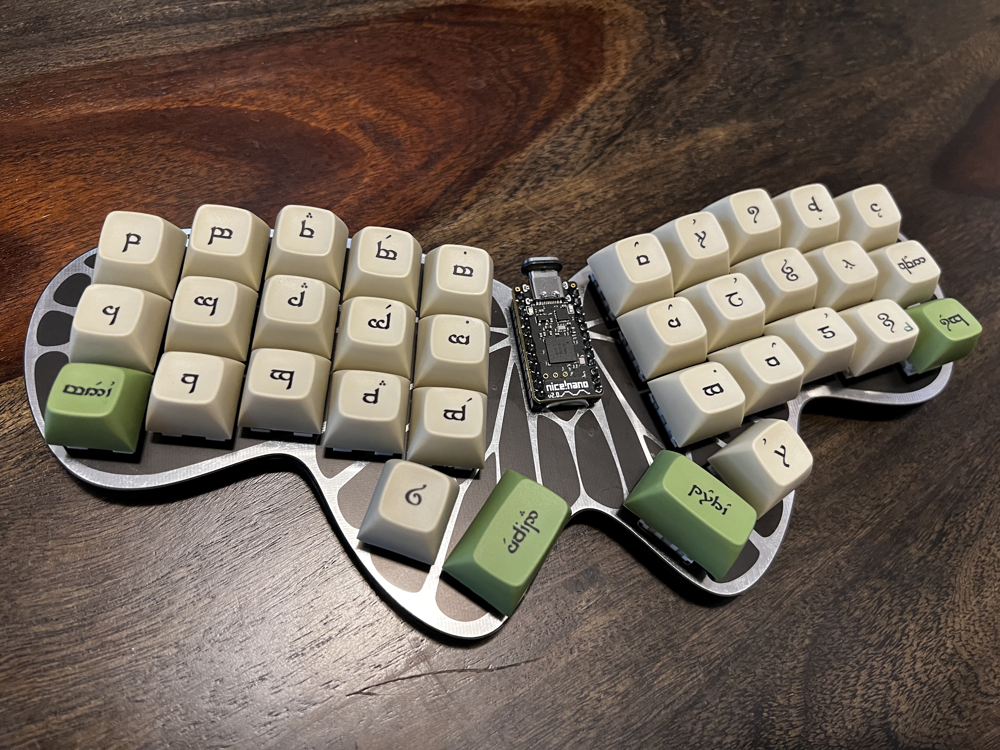

# Fiðrildi

Fiðrildi is a 34-key, ortholinear, butterfly-shaped, unibody split keyboard inspired by [Reviung](https://github.com/gtips/reviung), [Corne](https://github.com/foostan/crkbd), and the [Lord of the Rings Elvish keycaps](https://matt3o.com/the-tolkien-keycaps-are-finally-live/).

The column stagger is just slightly more exaggerated than the Corne, and the halves are tilted 2 degrees more than the Reviung.

