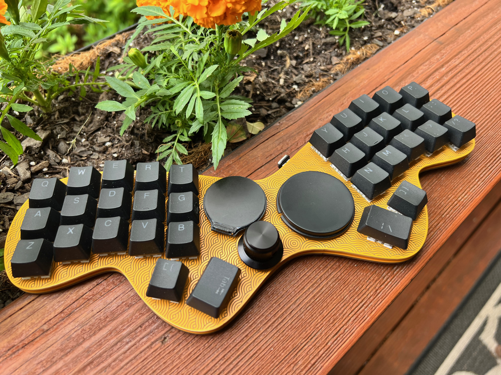

# Fiðrildi 2

Fiðrildi 2 is a 34-key, ortholinear, butterfly-shaped, unibody split keyboard inspired by [Reviung](https://github.com/gtips/reviung), [Corne](https://github.com/foostan/crkbd), and others.

It is designed specifically for the [0xcb Helios](https://github.com/0xCB-dev/0xCB-Helios), and uses all available pins. The Helios is soldered in to minimize the profile so that it can be sandwiched between the top plate and bottom PCB.

The PCB has 40 side-mounted SK6812-SIDE LEDs that shine horizontally outward from the underside of the PCB.

There are 4-pin and 8-pin JST SH (1 mm) connectors on the top of the PCB for connecting extras (LCD, Cirque, etc.).

The column stagger is more exaggerated than the Corne, and the halves are tilted 5 degrees more than the Reviung.

## Issues with Version 2.0

  - The side-mounted LEDs are very difficult to work with, and the horizontal lighting effect is not worth the effort of dealing with them.
  - Issues with pin assignments on J4?
